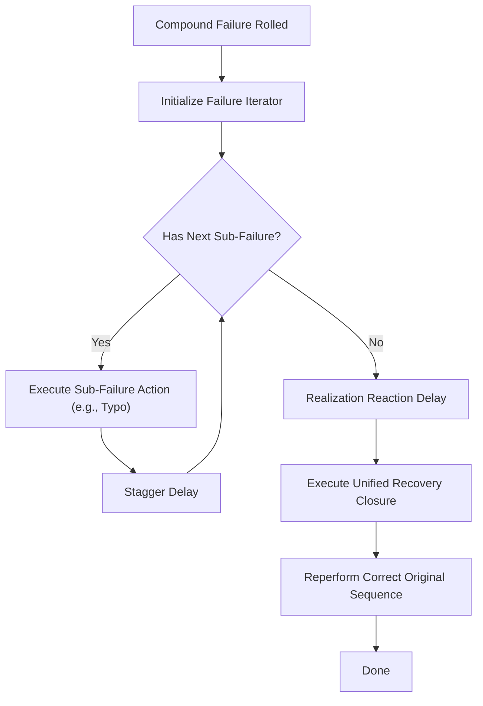

# Implementation Plan: User-Specified Compound Failures

This plan details how to implement **compound failures** (combining 2, 3, or more failures together) as developer-defined variants with a single, unified recovery closure.

---

## 1. Concept: Explicit Compound Failures
Instead of having the humanizer engine randomly pair up failures (which causes conflicting recoveries and unpredictable states), we allow the developer to explicitly define compound mistakes.

### Key Benefits:
* **Unlimited Composition**: The developer can combine any number of failures (e.g. `MissedModifier` + `WrongKeyTap` + `ReleasedModifierEarly`).
* **Deterministic Recovery**: There is exactly **one** recovery callback associated with the compound failure, bypassing conflicts and sequence resolution issues.
* **Granular Probability Control**: Assign a distinct, individual probability for the compound event (e.g. 5% for a single typo, but only 0.5% for a double typo + missed modifier).

---

## 2. Execution Flow



---

## 3. Implementation Details

### Step 1: Add a `Compound` Variant to Failure Enums
In `src/humanizer/failures.rs`, add a recursively composable `Compound` variant:

```rust
#[derive(Debug, Clone, PartialEq, Eq)]
pub enum ClickFailure {
    Misclick,
    MisclickTo(TargetArea),
    WrongButton(Button),
    DoubleClick,
    /// Compound click failure combining multiple mouse errors in sequence.
    Compound(Vec<ClickFailure>),
}

#[derive(Debug, Clone, PartialEq, Eq)]
pub enum KeyCombinationFailure {
    MissedModifier(Key),
    WrongKeyTap(Key),
    ReleasedModifierEarly(Key),
    ModifierStuck(Key),
    /// Compound key failure combining multiple modifier/key errors in sequence.
    Compound(Vec<KeyCombinationFailure>),
}
```

> **Note**: `KeyCombinationFailure` must drop `Copy` once `Compound` is added (since `Vec` is not `Copy`).

### Step 2: Extract Per-Failure Execution into Helper Methods
Refactor the inline `match` blocks in `mouse.rs` and `keyboard.rs` into dedicated helpers so compound variants can call them recursively:

```rust
// src/humanizer/mouse.rs
fn execute_click_failure(
    &mut self,
    failure: &ClickFailure,
    area: &TargetArea,
    button: Button,
) -> Result<(), String> {
    match failure {
        ClickFailure::Compound(sub_failures) => {
            log::trace!("Executing compound click failure with {} sub-errors", sub_failures.len());
            for sub in sub_failures {
                self.execute_click_failure(sub, area, button)?;
                // Small stagger delay between chained sub-errors
                std::thread::sleep(std::time::Duration::from_millis(50));
            }
        }
        ClickFailure::Misclick => { /* ... existing action ... */ }
        ClickFailure::MisclickTo(error_area) => { /* ... */ }
        ClickFailure::WrongButton(wrong_btn) => { /* ... */ }
        ClickFailure::DoubleClick => { /* ... */ }
    }
    Ok(())
}
```

### Step 3: Call the Helper from `click_area` and `click_area_flexible`
Replace the inline `match` with `self.execute_click_failure(&failure, area, button)?;` in both methods. The recovery still runs once after all sub-failures complete, inside `execute_recovery_context`.

---

## 4. API Usage Example

```rust
use rs3_input::{HumanizedDevice, TargetArea, Point, ClickFailure};
use enigo::Button;

let compound = ClickFailure::Compound(vec![
    ClickFailure::Misclick,
    ClickFailure::WrongButton(Button::Right),
]);

let mut failures = vec![
    (
        compound,
        0.01, // 1% probability for this specific compound event
        Box::new(|device: &mut HumanizedDevice<_>| {
            // Single, unified recovery for the whole compound sequence
            log::warn!("Recovering from misclick + wrong-button compound error...");
            device.click_area(&target, Button::Left, false)?;
            Ok(())
        }) as Box<dyn FnMut(&mut _) -> _>
    ),
    (
        ClickFailure::Misclick,
        0.05, // 5% for a plain misclick
        Box::new(|device: &mut HumanizedDevice<_>| { Ok(()) }) as Box<dyn FnMut(&mut _) -> _>
    ),
];

device.click_area_flexible(&target_area, Button::Left, &mut failures)?;
```

---

## 5. Design Decisions

| Decision | Rationale |
|---|---|
| Developer-specified only (not random pairing) | Avoids conflicting recoveries and unpredictable multi-failure state |
| Single recovery closure per compound | Keeps the API simple; the developer knows the full context of what failed |
| Sub-failures execute sequentially with stagger delays | Mimics realistic human cascading mistakes, not instantaneous double-errors |
| `Compound` is a recursive variant (not a flat list type) | Allows nesting compounds within compounds for complex scenarios |
| `KeyCombinationFailure` loses `Copy` | Necessary to hold a `Vec`; callers must clone or borrow |

---

## 6. Status

⬜ **Not yet implemented** — pending prioritization.
