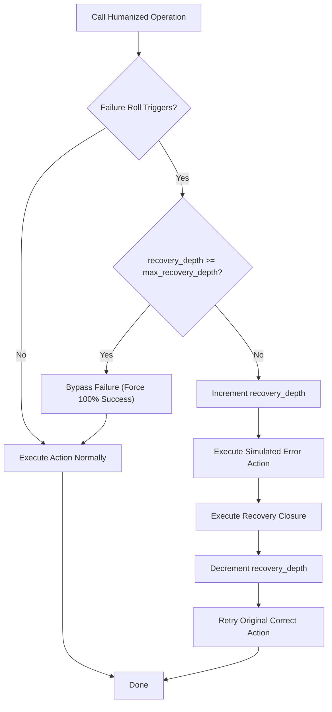

# Implementation Plan: Recursive Failure Recovery

This plan outlines how to support **recursive failure recovery** (e.g. allowing recovery closures to execute humanized calls that can themselves fail) while maintaining absolute protection against infinite loops and stack overflows.

---

## 1. Problem Statement
When a recovery closure is executed (e.g., clicking a "Cancel" button to clear a misclick), that recovery action is also a humanized call. In a realistic simulation, this recovery action can *also* fail.

However, allowing recovery actions to fail recursively introduces a major risk of **infinite recovery loops** (e.g., trying to recover from a failure, failing the recovery, trying to recover from that failure, and recursing forever).

---

## 2. Proposed Architecture: Depth-Gated Recursion

To support this safely, we propose tracking the active recovery nesting depth using a depth counter on the `HumanizedDevice`.

### Key Components:
1. **Nesting Counter (`recovery_depth`)**: An internal counter on `HumanizedDevice` indicating how many recovery closures are currently executing.
2. **Limit Guard (`max_recovery_depth`)**: The maximum allowed nesting level (typically `1` or `2`).
3. **Automatic Disabling**: Once the nesting counter exceeds the threshold, failure simulation is temporarily disabled, making subsequent actions 100% deterministic to guarantee recovery completion.

---

## 3. Control Flow Diagram



---

## 4. Implementation Details

### Step 1: Update `HumanizedDevice` State
Add counters to `src/humanizer/device.rs`:
```rust
pub struct HumanizedDevice<D: InputDevice> {
    pub(super) inner: D,
    pub(super) chance_calculator: Option<Box<dyn FailureChanceCalculator>>,
    pub config: HumanizerConfig,

    // Safety recursion guards
    pub recovery_depth: usize,
    pub max_recovery_depth: usize,
}
```

### Step 2: Add Guard Helpers
```rust
impl<D: InputDevice> HumanizedDevice<D> {
    /// Returns true if failure simulations should be bypassed due to recovery depth.
    pub(super) fn should_bypass_failures(&self) -> bool {
        self.recovery_depth >= self.max_recovery_depth
    }

    /// Safely executes a block of code within a recovery context, incrementing the counter.
    pub(super) fn execute_recovery_context<F, T>(&mut self, mut f: F) -> T
    where
        F: FnMut(&mut Self) -> T,
    {
        self.recovery_depth += 1;
        let result = f(self);
        self.recovery_depth -= 1;
        result
    }
}
```

### Step 3: Integrate with Click and Keyboard Roll Loops
Inside `src/humanizer/mouse.rs` and `src/humanizer/keyboard.rs`, check the bypass status before rolling probabilities:
```rust
let is_failure_allowed = allow_error && !self.should_bypass_failures();

if is_failure_allowed {
    // Perform standard failure checks and roll...
    if triggered {
        // Run error action...
        // Execute recovery within context guard:
        self.execute_recovery_context(|device| {
            recovery(device)
        })?;
    }
}
```

---

## 5. Status

✅ **Implemented** — `recovery_depth`, `max_recovery_depth`, `should_bypass_failures()`, and `execute_recovery_context()` are live in `src/humanizer/device.rs`. All three failure surfaces (mouse clicks, keyboard text, key combinations) respect the nesting guard. Verified by `test_recursive_failure_recovery_guard` in `src/mock.rs`.
